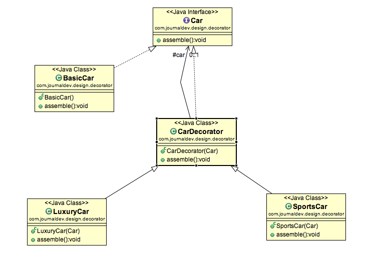

* [Creational Patterns]()
* [Structural Patterns]()
  * [Decorator](#decorator)
* [Behavioral Patterns]()

### Decorator
- is a structural design pattern that lets you attach new behaviors to objects by placing these objects inside special wrapper objects that contain the behaviors.
- can be called <i>wrapper</i>
  
```
// component interface
public interface Car {

	public void assemble();
}

// component implementation
package com.journaldev.design.decorator;

public class BasicCar implements Car {

	@Override
	public void assemble() {
		System.out.print("Basic Car.");
	}
}

// base decorator
public class CarDecorator implements Car {

	protected Car car;
	
	public CarDecorator(Car c){
		this.car=c;
	}
	
	@Override
	public void assemble() {
		this.car.assemble();
	}
}

// concrete decorator: extend and modify
public class SportsCar extends CarDecorator {

	public SportsCar(Car c) {
		super(c);
	}

	@Override
	public void assemble(){
		super.assemble();
		System.out.print(" Adding features of Sports Car.");
	}
}

// client
public class DecoratorPatternTest {

	public static void main(String[] args) {
		Car sportsCar = new SportsCar(new BasicCar());
		sportsCar.assemble();
		System.out.println("\n*****");
		
		Car sportsLuxuryCar = new SportsCar(new LuxuryCar(new BasicCar()));
		sportsLuxuryCar.assemble();
    // Basic Car. Adding features of Sports Car.
	}
}
```
